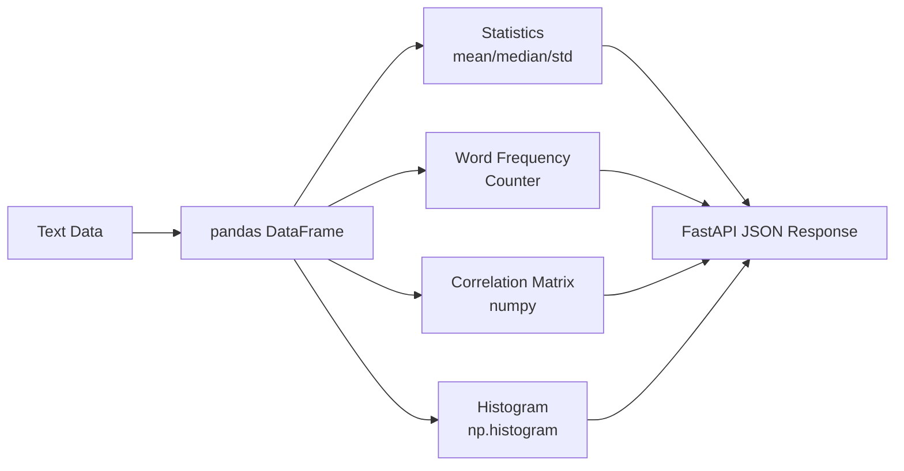

# Text Analytics EDA

Text analytics with **pandas + numpy** — statistics, word frequency, correlation, histogram — served via FastAPI.

## Architecture



## What it demonstrates

| Skill | How |
|-------|-----|
| **pandas** | DataFrame creation, filtering, aggregation, correlation |
| **numpy** | Mean, std, histogram, matrix operations |
| **EDA** | Statistics, word frequency, lexical diversity, correlation |
| **matplotlib** | Available for plot generation (histogram data endpoint) |
| **FastAPI** | REST API for analytics queries |

## Quick Start

```bash
git clone https://github.com/Vadtop/text-analytics-eda.git
cd text-analytics-eda

pip install -r requirements.txt
uvicorn app.main:app --reload

# Or with Docker
docker-compose up --build

# API docs
open http://localhost:8000/docs
```

## API Endpoints

| Method | Endpoint | Description |
|--------|----------|-------------|
| `GET` | `/stats` | Text statistics (word count, char count, lexical diversity) |
| `GET` | `/word-frequency` | Top word frequencies |
| `GET` | `/correlation` | Correlation matrix of text metrics |
| `POST` | `/histogram` | Histogram data for any numeric column |
| `POST` | `/filter` | Filter texts by criteria |
| `GET` | `/dataframe/head` | First 5 rows of DataFrame |
| `GET` | `/health` | Health check |

## Example Usage

```bash
# Statistics
curl http://localhost:8000/stats

# Word frequency (top 10)
curl http://localhost:8000/word-frequency?top_n=10

# Correlation matrix
curl http://localhost:8000/correlation

# Histogram of word counts
curl -X POST http://localhost:8000/histogram \
  -H "Content-Type: application/json" \
  -d '{"column": "word_count", "bins": 5}'

# Filter texts
curl -X POST http://localhost:8000/filter \
  -H "Content-Type: application/json" \
  -d '{"min_words": 8, "max_words": 15}'
```

## Analytics Features

- **word_count, char_count, avg_word_length** — basic text metrics
- **unique_words, lexical_diversity** — vocabulary richness
- **has_number** — detect numeric content
- **word_frequency** — top N words (stop words filtered)
- **correlation_matrix** — Pearson correlation between metrics
- **histogram** — bin data for visualization

## Tech Stack

- **pandas** — DataFrame, filtering, aggregation
- **numpy** — statistics, histogram, correlation
- **matplotlib** — available for plot generation
- **FastAPI** — REST API

## License

MIT
